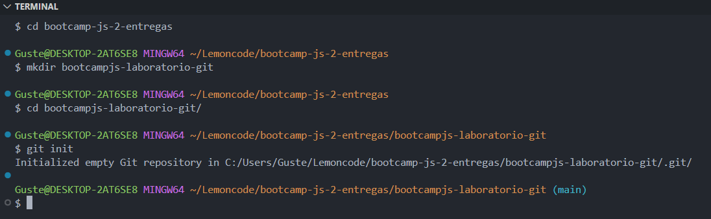
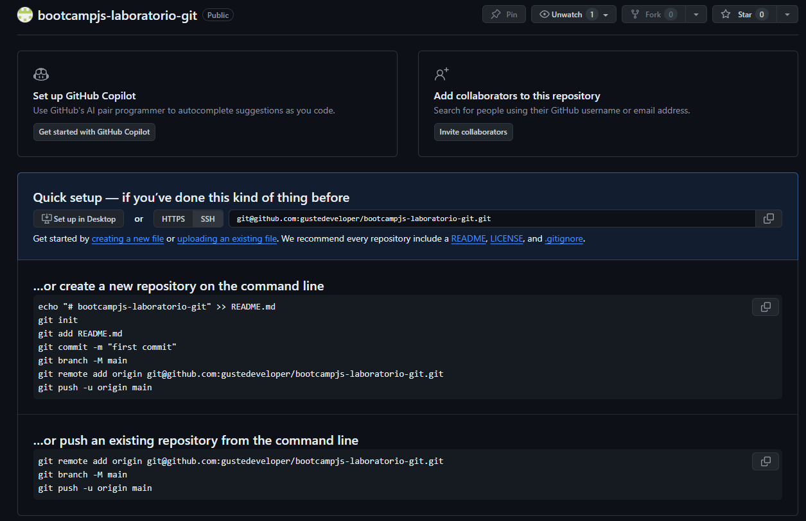
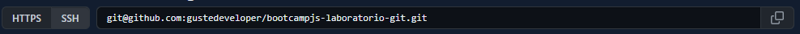
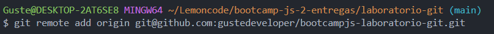
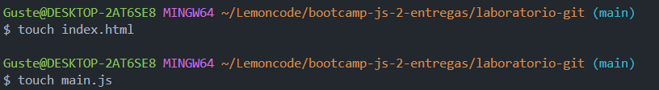
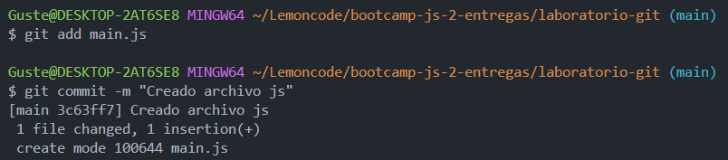
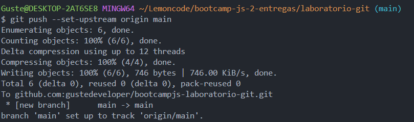
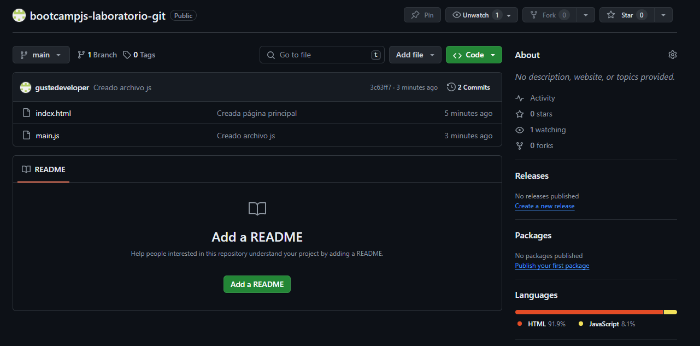
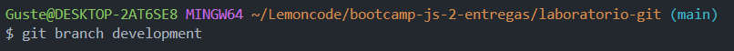

# Bootcamp JavaScript 2 - Lemoncode

## Laboratorio Git

Este laboratorio tiene como objetivo practicar los comandos básicos de Git:

1. Crear un repositorio en local.
2. Subir el repositorio a GitHub.
3. Hacer commit y push.
4. Crear una rama.
5. Hacer un merge y resolver los conflictos que se presenten si fuera el caso.

A continuación, me dispongo a explicar todo el proceso que he seguido para crear este laboratorio.

### Crear e inicializar un repositorio en local

Localizo, a través del terminal, el directorio en el que deseo crear el repositorio; creo una carpeta con el nombre del repositorio, ingreso en ella e inicializo el repositorio de Git

### Subir el repositorio a GitHub

Toca elegir un nombre que esté disponible para el repositorio y crearlo

Copio el link del repositorio

Conecto el repositorio local con el repositorio en GitHub

### Hacer _commit_ y _push_

Creo los primeros archivos

Los añado al staging y creo un commit con un mensaje descriptivo

Toca subir los cambios al repositorio en GitHub

Refresco la página para ver que todo se ha subido correctamente

### Crear una rama

A continuación, creo una nueva rama llamada **_development_**

