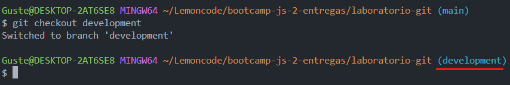

# Bootcamp JavaScript 2 - Lemoncode

## Laboratorio Git

Este laboratorio tiene como objetivo practicar los comandos básicos de Git:

1. Crear un repositorio en local.
2. Subir el repositorio a GitHub.
3. Hacer commit y push.
4. Crear una rama.
5. Hacer un merge y resolver los conflictos que se presenten si fuera el caso.

A continuación, me dispongo a explicar todo el proceso que he seguido para crear este laboratorio.

### Crear e inicializar un repositorio en local

Localizo, a través del terminal, el directorio en el que deseo crear el repositorio; creo una carpeta con el nombre del repositorio, ingreso en ella e inicializo el repositorio de Git


### Subir el repositorio a GitHub


Toca elegir un nombre que esté disponible para el repositorio y crearlo


Copio el link del repositorio


Conecto el repositorio local con el repositorio en GitHub


### Hacer _commit_ y _push_

Creo los primeros archivos


Los añado al staging y creo un commit con un mensaje descriptivo


Toca subir los cambios al repositorio en GitHub


Refresco la página para ver que todo se ha subido correctamente


### Crear una rama

A continuación, creo una nueva rama llamada **_development_**


Cambio a la nueva rama



Realizo cambios en uno de los archivos en la rama **_development_**. En este caso, he añadido un párrafo al archivo **_html_**


Reflejo los cambios añadiéndolos y realizando un **_commit_**


Subo los cambios a GitHub


### Hacer un _merge_ y resolver los conflictos que se presenten si fuera el caso

Toca combinar ambas ramas. Para ello, vuelvo a la rama **_main_**


Hago **_merge_**. Si no hay conflictos, los cambios realizados en la rama **_development_** se incorporarán directamente a la rama **_main_**


Si hubiese conflictos (en el escenario de que estoy trabajando en un equipo y alguien elimina un archivo en la rama **_main_**, añade y hace commit de los cambios, y yo por mi parte, he realizado cambios en ese archivo en la rama **_development_**, los he añadido y realizado commit) ocurriría lo siguiente a la hora de hacer **_merge_**:

Git nos avisaría del conflicto


Para solucionarlo, vamos al apartado de **_Source control_** y nos mostraría lo siguiente:


Clicando sobre el + aparecería la siguiente pestaña que explica claramente el origen del conflicto y las posibles soluciones


> Otra alternativa sería dar marcha atrás al **_merge_**, si todavía no hemos commiteado, con el siguiente comando

```
git merge --abort
```

En este caso, decido mantener la versión de la rama **_development_** que sería recuperar el archivo borrado. Una vez solucionado el conflicto, commiteo los cambios


Y hago **_push_** al repositorio de GitHub


Y eso es todo.

Muchas gracias por la atención, hasta la próxima 🙂
